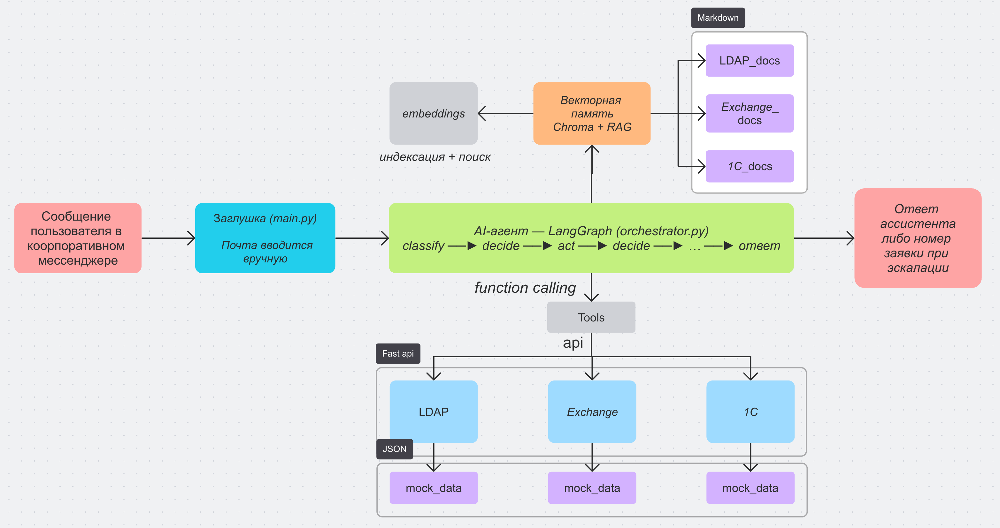

# Support Agent

Прикладной ИИ-агент технической поддержки корпорации: обрабатывает обращения
сотрудников из корпоративного мессенджера, помогает решать проблемы
с корпоративными системами (LDAP, Exchange, 1С) — находит ответы в базе знаний
(RAG), выполняет операции через API (function calling) или передаёт обращение
человеку-специалисту, если егент не знает как решить проблему.

---

## Логика работы

Предположим, в корпорации есть корпоративный мессенджер (неважно, какой:
Slack, Teams, Mattermost и т.п.). Сотрудник пишет сообщение в личку боту
технической поддержки (например, «не могу войти в систему» или «ящик
переполнен»). ИИ-агент обрабатывает это сообщение и помогает сотруднику:

1. идентифицирует заявителя по корпоративной почте — в полной реализации её
   берут из профиля сотрудника, написавшего боту (мессенджер передаёт автора
   сообщения), см. «Заглушка идентификации»;
2. классифицирует тему обращения;
3. собирает факты: запрашивает состояние систем через API и находит релевантную
   документацию в базе знаний (RAG);
4. принимает решение — **решить** (выполнить операцию), **подсказать**
   (дать инструкции из базы знаний) или **эскалировать** (передать специалисту);
5. чувствительные операции (сброс пароля, разблокировка, завершение сессии,
   изменение квоты) выполняет только после явного подтверждения пользователя.


**Бот/мессенджер в проекте не реализован.** Вместо него — консольная
заглушка: пользователь вручную указывает свою почту (это имитирует автора
сообщения из мессенджера). В полной реализации этот шаг отключается, 
так как в месенджере будет event из которого можно брать email пользователя.

## Сценарий работы агента

```
Вход      Сообщение пользователя в личку боту в корпоративном мессенджере.
          Бот не реализован — заглушка (main.py): пользователь вручную
          указывает свою почту; в полной версии её передаёт мессенджер.
```

```
Обработка Агентный цикл на LangGraph (Reason → Act → Observe):
          classify (лёгкая модель) → decide (тяжёлая модель, function calling)
          → act (исполнение инструментов) → decide (проверка результата) → …
          └─ RAG: поиск в базе знаний; инструменты: API LDAP/Exchange/1С
```

```
Результат Ответ ассистента: что найдено/сделано и что делать дальше,
          либо номер заявки T-XXXXXXXX при эскалации.
          └─ трейс шагов в data/trace.jsonl, метрики в data/metrics.jsonl
```

## Архитектура



**Embedding-модель** — часть LM Studio (как и chat-LLM). Она строит векторы
документов при индексации базы знаний и векторы запросов при RAG-поиске,
поэтому на схеме связана с блоком «Векторная память». Chat-модель обслуживает
агентный цикл (классификация темы, рассуждение, function calling).

Компоненты:
- **`main.py`** — консольная заглушка входа (имитирует сообщение от бота
  корпоративного мессенджера, точка входа);
- **`agent/orchestrator.py`** — агентный цикл на LangGraph (классификация,
  рассуждение, исполнение инструментов, guardrails);
- **`agent/toolkit.py`** — инструменты function calling, circuit breaker,
  валидация аргументов;
- **`agent/rag.py`** — векторная память (Chroma, база знаний по документации
  сервисов);
- **`agent/llm.py`** — клиент LM Studio, два модельных маршрута (heavy/light),
  retry с backoff;
- **`agent/metrics.py`**, **`agent/trace.py`** — метрики и пошаговое логирование;
- **`agent/prompts/`**, **`agent/tools/`** — промты и описания инструментов (JSON);
- **`services/`** — эмуляторы внешних систем с мок-данными и документацией.

## Агентный цикл Reason → Act → Observe

Граф: `START → classify → decide → act → decide → … → END`

| Шаг        | Что происходит                                                             | Модель  |
|------------|----------------------------------------------------------------------------|---------|
| `classify` | определение темы обращения (ldap / exchange / onec / other)                | лёгкая  |
| `decide`   | планирование: какой инструмент вызвать или дать ответ (Reason)             | тяжёлая |
| `act`      | исполнение инструментов, результат возвращается модели (Act)               | —       |
| `decide`   | проверка результата, продолжение цикла или финальный ответ (Observe)       | тяжёлая |
| `nudge`    | напоминание проверить систему, если модель ответила без вызова инструмента | —       |

Ветвления: решение проблемы / консультация из базы знаний / эскалация
специалисту (`escalate_to_human`). Защита от зацикливания — лимит шагов (6).

## Инструменты (function calling)

| Инструмент              | Назначение                                    | Чувствительный |
|-------------------------|-----------------------------------------------|----------------|
| `search_knowledge_base` | поиск в базе знаний (RAG)                     | нет            |
| `get_ldap_user`         | состояние учётной записи LDAP                 | нет            |
| `unlock_ldap_user`      | разблокировать учётную запись                 | да             |
| `reset_ldap_password`   | сбросить пароль                               | да             |
| `get_exchange_mailbox`  | состояние почтового ящика                     | нет            |
| `set_exchange_quota`    | изменить квоту ящика                          | да             |
| `list_1c_sessions`      | список сессий 1С                              | нет            |
| `terminate_1c_session`  | завершить сессию 1С                           | да             |
| `unlock_1c_user`        | разблокировать пользователя в 1С              | да             |
| `escalate_to_human`     | передать обращение специалисту (заявка `T-…`) | нет            |

Описания инструментов хранятся отдельно в `agent/tools/*.json` и передаются
модели как JSON-схемы (function calling). Retrival из базы знаний управляется
самим агентом — он сам решает, когда вызвать `search_knowledge_base`.

## Тестовые системы

Для наглядности проекта созданы **три тестовые системы-эмулятора со своими API**
(в реальной корпорации на их месте были бы настоящие LDAP, Exchange и 1С).
Все эмуляторы реализованы на FastAPI, держат мок-данные в памяти
(`mock_data.json`), возвращают JSON.

### LDAP — каталог пользователей (порт 8101)

Эмулирует LDAP-каталог: учётные записи, блокировки, истечение пароля.

| Метод | Путь                            | Что делает                                                         |
|-------|---------------------------------|--------------------------------------------------------------------|
| GET   | `/users/{email}`                | состояние учётной записи (активна, заблокирована, истёк ли пароль) |
| POST  | `/users/{email}/unlock`         | разблокировать учётную запись                                      |
| POST  | `/users/{email}/reset_password` | сбросить пароль (пометить смену)                                   |

### Exchange — почтовые ящики (порт 8102)

Эмулирует Microsoft Exchange: ящики, размер, квоты.

| Метод | Путь                           | Что делает                                            |
|-------|--------------------------------|-------------------------------------------------------|
| GET   | `/mailboxes/{email}`           | состояние ящика (размер, квота, активность)           |
| POST  | `/mailboxes/{email}/set_quota` | установить квоту ящика (например, временно увеличить) |

### 1С — базы и сессии (порт 8103)

Эмулирует 1С:Предприятие: пользователи и активные сессии.

| Метод | Путь                               | Что делает                       |
|-------|------------------------------------|----------------------------------|
| GET   | `/sessions`                        | список активных сессий           |
| POST  | `/sessions/{session_id}/terminate` | завершить сессию по её id        |
| POST  | `/users/{email}/unlock`            | разблокировать пользователя в 1С |

Каждый эмулятор хранит мок-данные (`mock_data.json`) и документацию по типовым
проблемам (`documentation/`), которая служит источником базы знаний для RAG.

## Память и контекст

- **Векторная память** — Chroma (`data/chroma`), источник — документация
  `services/*/documentation/*.md` (15 документов). Эмбеддинги строятся
  embedding-моделью из LM Studio.
- **История диалога** — реплики пользователя/ассистента передаются в каждый
  запуск графа, поэтому агент помнит контекст («да, увеличь квоту до 65 000»).

## Структура проекта

```
.
├── main.py                     # точка входа (консоль)
├── config/settings.py          # настройки (django-environ, .env)
├── agent/                      # ИИ-агент
│   ├── orchestrator.py         #   агентный цикл на LangGraph
│   ├── toolkit.py              #   инструменты + circuit breaker + валидация
│   ├── rag.py                  #   векторная память (Chroma, RAG)
│   ├── llm.py                  #   клиент LM Studio (heavy/light, retry)
│   ├── metrics.py              #   метрики и отчёт
│   ├── trace.py                #   пошаговое логирование
│   ├── evaluate.py             #   прогон сценариев оценки
│   ├── prompts/*.json          #   промты
│   └── tools/*.json            #   описания инструментов
├── services/                   # эмуляторы LDAP / Exchange / 1С
│   └── <service>/documentation #   база знаний (источник RAG)
├── evaluation/scenarios.json   # сценарии оценки
├── requirements.txt
└── .env.example                # шаблон переменных окружения
```

## Требования и установка

- Python 3.11+ (проект разработан на 3.14);
- LM Studio с загруженными моделями (LLM + embedding);
- локально запущенные сервисы-эмуляторы.

```bash
python -m venv .venv && source .venv/bin/activate

pip install -r requirements.txt

cp .env.example .env   # заполнить .env
```

## Запуск

### 1. Сервисы-эмуляторы

```bash
uvicorn services.ldap.app:app --port 8101 &      # LDAP
uvicorn services.exchange.app:app --port 8102 &  # Exchange
uvicorn services.onec.app:app --port 8103 &      # 1С
wait
```

Проверка: `curl http://localhost:8101/users/ivanov@corp.local`.
Схема API каждого сервиса — по адресу `/docs`.

### 2. Агент (консоль)

```bash
python main.py
```

Консоль — это **заглушка корпоративного мессенджера**: бот не реализован,
поэтому пользователь вручную указывает корпоративную почту (проверяется
в LDAP). В полной реализации с мессенджером этот шаг отключается, а почта
берётся автоматически из профиля сотрудника, написавшего боту.

После идентификации агент в цикле обрабатывает обращения. Шаги цикла
печатаются в консоль и пишутся в `data/trace.jsonl`. Каждый запуск
фиксируется в `data/metrics.jsonl`.

### 3. Оценка и метрики

```bash
python -m agent.evaluate   # прогон сценариев оценки (pass/fail + метрики)
python -m agent.metrics    # сводный отчёт: успех / время / токены / стоимость
```

## Примеры диалогов

### Пример 1. Переполненный почтовый ящик (Exchange)

```
Почта: kuznetsova@corp.local
  Здравствуйте, kuznetsova@corp.local! Опишите вашу проблему.

Вы> У меня переполнен почтовый ящик, не могу отправлять письма

  ∎ classify [openai/gpt-oss-20b] (0.5s): тема=exchange
  ∎ decide [openai/gpt-oss-20b]: get_exchange_mailbox
  ∎ act: get_exchange_mailbox -> size_mb=49999, quota_mb=50000
  ∎ decide [openai/gpt-oss-20b]: search_knowledge_base
  ∎ act: search_knowledge_base -> «Почтовый ящик переполнен»
  ∎ decide [openai/gpt-oss-20b]: финальный ответ

🤖 Ассистент: Проверил состояние вашего ящика: размер 49 999 МБ при квоте
50 000 МБ — он переполнен. Рекомендую очистить крупные письма, а при
необходимости временно увеличить квоту. Дайте знать, если нужно увеличить
квоту, — я выполню операцию.
      ⏱ 6.7s · LLM-вызовов 4 · токенов 2950 · ≈ $0.43

Вы> да, увеличь квоту до 55 000
  ∎ decide: set_exchange_quota
⚠️  Чувствительная операция: set_exchange_quota {"email": "kuznetsova@corp.local", "quota_mb": 55000}
    Подтвердить выполнение? [y/N]: y
  ∎ act: set_exchange_quota -> quota_mb=55000

🤖 Ассистент: Квота почтового ящика увеличена до 55 000 МБ. Повторите отправку
письма — теперь место должно хватить.
```

### Пример 2. Заблокированная учётная запись (LDAP)

```
Почта: petrova@corp.local

Вы> Не могу войти в систему, учётная запись заблокирована

  ∎ classify [openai/gpt-oss-20b]: тема=ldap
  ∎ decide [openai/gpt-oss-20b]: get_ldap_user
  ∎ act: get_ldap_user -> locked=true, password_expired=false
  ∎ decide [openai/gpt-oss-20b]: search_knowledge_base
  ∎ act: search_knowledge_base -> «Учётная запись заблокирована»
  ∎ decide [openai/gpt-oss-20b]: unlock_ldap_user

⚠️  Чувствительная операция: unlock_ldap_user {"email": "petrova@corp.local"}
    Подтвердить выполнение? [y/N]: y

  ∎ act: unlock_ldap_user -> unlocked=true
  ∎ decide [openai/gpt-oss-20b]: get_ldap_user   # проверка результата
  ∎ act: get_ldap_user -> locked=false
  ∎ decide [openai/gpt-oss-20b]: финальный ответ

🤖 Ассистент: Учётная запись petrova@corp.local была заблокирована из-за
неудачных попыток входа. Я разблокировал её — повторный вход должен работать.
      ⏱ 6.4s · LLM-вызовов 6 · токенов 3700 · ≈ $0.52
```

### Пример 3. Запрос вне полномочий — эскалация

```
Почта: ivanov@corp.local

Вы> Настройте мне корпоративный VPN для удалённой работы

  ∎ classify [openai/gpt-oss-20b]: тема=other
  ∎ decide [openai/gpt-oss-20b]: escalate_to_human
  ∎ act: escalate_to_human -> ticket=T-3F9C21AD

🤖 Ассистент: Настройка VPN выходит за рамки моих полномочий и доступных
инструментов. Я передал ваше обращение специалисту (заявка T-3F9C21AD) —
с вами свяжутся по её выполнению.
      ⏱ 3.5s · LLM-вызовов 3 · токенов 2150 · ≈ $0.26
```

## Пример оценки и метрик

### python -m agent.evaluate

```
Оценка 3 сценариев...

[OK] exchange_mailbox_full: resolved (ожид. resolved) — 6.7s, tools=2, tokens=2950, ≈$0.43
[OK] ldap_login_issue: resolved (ожид. resolved) — 6.4s, tools=4, tokens=3700, ≈$0.52
[OK] vpn_out_of_scope: escalated (ожид. escalated) — 3.5s, tools=1, tokens=2150, ≈$0.26

Итог: 3/3 сценариев прошли
Сводные метрики за прогон:
  runs: 3
  resolved: 2
  escalated: 1
  failed: 0
  success_rate: 1.0
  total_sec: 16.6
  avg_sec_per_run: 5.5
  total_tokens: 8800
  avg_tokens_per_run: 2933.3
  estimated_cost_usd: 1.21
```

### python -m agent.metrics

```
=== Метрики агента ===
  runs: 4
  resolved: 3
  escalated: 1
  failed: 0
  success_rate: 1.0
  total_sec: 30.3
  avg_sec_per_run: 7.6
  total_tokens: 13096
  avg_tokens_per_run: 3274.0
  estimated_cost_usd: 1.7623
```

## Оценка и безопасность

**Метрики** (успех / время / стоимость): каждый запуск записывается
в `data/metrics.jsonl` — исход (`resolved` / `escalated` / `failed`), время,
число LLM-вызовов, токены (prompt/completion), стоимость, число инструментов.
Отчёт — `python -m agent.metrics`.

**Ограничения и защита:**
- подтверждение чувствительных операций в консоли;
- лимит шагов цикла (6) — защита от зацикливания;
- retry с backoff для LLM (3 попытки, экспоненциальная пауза);
- circuit breaker для сервисов (после 3 сбоев подряд — размыкание на 30 с);
- валидация аргументов инструментов (email, квота, id сессии и т.п.);
- проверка вывода: напоминание агенту проверить систему, если он ответил
  без вызова инструментов, и пометка «failed» при пустом ответе.

**Оценка:** `python -m agent.evaluate` прогоняет сценарии
(`evaluation/scenarios.json`), сверяет исход с ожидаемым и выводит сводные
метрики (пример: 3/3 сценария прошли, success_rate 1.0).

## Переменные окружения

Все настройки читаются из `.env` (шаблон — `.env.example`).

| Переменная              | Тип   | Описание                                        | Значение по умолчанию                  |
|-------------------------|-------|-------------------------------------------------|----------------------------------------|
| `DEBUG`                 | bool  | режим отладки                                   | `False`                                |
| `LM_STUDIO_HOST`        | str   | адрес API LM Studio (OpenAI-совместимый)        | `http://localhost:1234/v1`             |
| `LM_STUDIO_API_KEY`     | str   | API-ключ (LM Studio не проверяет его)           | `lm-studio`                            |
| `LM_STUDIO_MODEL_HEAVY` | str   | тяжёлая модель (рассуждение, function calling)  | —                                      |
| `LM_STUDIO_MODEL_LIGHT` | str   | лёгкая модель (классификация темы)              | —                                      |
| `EMBEDDING_MODEL`       | str   | embedding-модель для RAG                        | `text-embedding-nomic-embed-text-v1.5` |
| `CHROMA_COLLECTION`     | str   | имя коллекции в Chroma                          | `support_kb`                           |
| `TRACE_FILE_NAME`       | str   | имя файла пошагового лога                       | `trace.jsonl`                          |
| `METRICS_FILE_NAME`     | str   | имя файла метрик                                | `metrics.jsonl`                        |
| `COST_PER_1K_INPUT`     | float | условная стоимость $ за 1K input-токенов        | `0.10`                                 |
| `COST_PER_1K_OUTPUT`    | float | условная стоимость $ за 1K output-токенов       | `0.40`                                 |
| `LDAP_SERVICE_HOST`     | str   | хост сервиса LDAP                               | `localhost`                            |
| `LDAP_SERVICE_PORT`     | str   | порт сервиса LDAP (строка, подставляется в URL) | `8101`                                 |
| `EXCHANGE_SERVICE_HOST` | str   | хост сервиса Exchange                           | `localhost`                            |
| `EXCHANGE_SERVICE_PORT` | str   | порт сервиса Exchange                           | `8102`                                 |
| `ONEC_SERVICE_HOST`     | str   | хост сервиса 1С                                 | `localhost`                            |
| `ONEC_SERVICE_PORT`     | str   | порт сервиса 1С                                 | `8103`                                 |

## Рекомендуемые модели

Для function calling рекомендуется **`openai/gpt-oss-20b`** (задать в
`LM_STUDIO_MODEL_HEAVY` и `LM_STUDIO_MODEL_LIGHT`). Проверено в прогонах:
модель стабильно вызывает инструменты, отвечает быстро и структурированно.

С **`qwen3-coder-30b-a3b-instruct-mlx`** не получилось: function calling
у неё нестабилен. Вместо вызова инструмента модель часто отвечала «планом»
(например, «Сначала я проверю вашу учётную запись») и завершала диалог,
ничего не сделав. Попытки обойти это не дали гарантий:

- принудительный `tool_choice='required'` игнорировался — модель возвращала
  `finish_reason: stop` без `tool_calls`;

- автоматическая проверка (`diagnose`) и напоминание (`nudge`) помогали лишь
  частично, а после напоминания модель иногда возвращала пустой ответ.

Для агентного цикла Reason → Act → Observe такая непредсказуемость
неприемлема, поэтому проект переведён на gpt-oss-20b.

**`mistralai_mistral-small-3.2-24b`** тоже не подошла: LM Studio не смогла
собрать парсер для её chat-шаблона под tools («Unable to generate parser for
this template»).